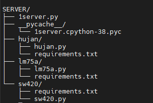

# AutoConfig-IOTSensor
### Auto-configuration system, used when adding new sensors on IoT devices (based on raspberry pi) automatically installs the firmware
## 1. Device side
#### **This program for device**
This repo creates a library named ["listener"](https://github.com/syahrul419/AutoConfig-IOTSensor/tree/master/Device-side/) to listen/wait for new sensors installed or not,
and there's also [main.py](https://github.com/syahrul419/AutoConfig-IOTSensor/tree/master/Device-side/) which manages everything, main.py sets what action to take if the system detects a new sensor installed. 
For example, in the listener library there are 3 new sensors that can be detected:
* LM75A (temperature)
* SW420 (vibration)
* YL-83 (rain/water)
## 2. Server side
**This program is for the server**, as a configuration place when there is a request from the device if there is a new sensor that requires configuration or firmware to be installed. Using the FastAPI framework to create servers.
